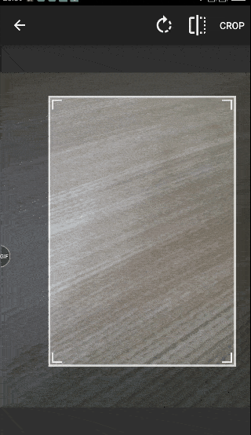
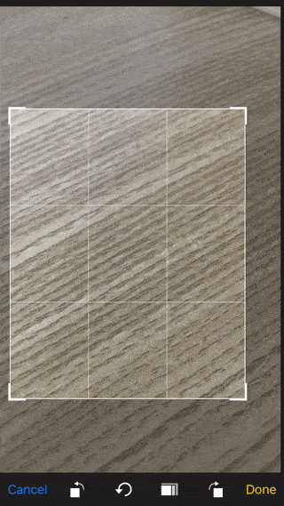
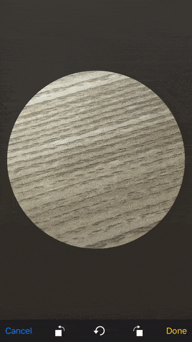

# ImageCropper.Forms

Xamarin.Forms plugin to crop and rotate photos.

[](https://www.nuget.org/packages/ImageCropper.Forms/)

Supports Android and iOS.
* Android library from : https://github.com/ArthurHub/Android-Image-Cropper
* iOS library from : https://github.com/TimOliver/TOCropViewController

## Features

* Cropping image.
* Rotating image.
* Aspect ratio.
* Circle/Rectangle shape.

## Screen-Shots

### Android
 

### iOS
 

## Setup

* Install the [nuget package](https://www.nuget.org/packages/ShapeControl.Forms/) in portable and all platform specific projects.
* This plugin uses the [MediaPlugin](https://github.com/jamesmontemagno/MediaPlugin/blob/master/README.md). Be sure to complete the full setup this plugin. Please fully read through the [MediaPlugin description](https://github.com/jamesmontemagno/MediaPlugin/blob/master/README.md).

### Android

Add the following to your AndroidManifest.xml inside the <application> tags:
```xml	
	<activity android:name="com.theartofdev.edmodo.cropper.CropImageActivity"
	          android:theme="@style/Base.Theme.AppCompat"/>	
```

In MainActivity.cs file:
```cs
    Stormlion.ImageCropper.Droid.Platform.Init();

    global::Xamarin.Forms.Forms.Init(this, bundle);
```
```cs
    protected override void OnActivityResult(int requestCode, Result resultCode, Intent data)
    {
        base.OnActivityResult(requestCode, resultCode, data);

        Stormlion.ImageCropper.Droid.Platform.OnActivityResult(requestCode, resultCode, data);
    }
```

### iOS

In AppDelegate.cs file:

```cs
    Stormlion.ImageCropper.iOS.Platform.Init();
```
## Usage

### Show ImageCropper page.
```cs
    new ImageCropper()
    {
        Success = (imageFile) =>
        {
            Device.BeginInvokeOnMainThread(() =>
            {
                imageView.Source = ImageSource.FromFile(imageFile);
            });
        }
    }.Show(this);
```
### Show it with additional parameters.
```cs
    new ImageCropper()
    {
        PageTitle = "Test Title",
        AspectRatioX = 1,
        AspectRatioY = 1,
	CropShape = ImageCropper.CropShapeType.Oval,
	SelectSourceTitle = "Select source",
	TakePhotoTitle = "Take Photo",
	PhotoLibraryTitle = "Photo Library",
	CancelButtonTitle = "Cancel",
        Success = (imageFile) =>
        {
            Device.BeginInvokeOnMainThread(() =>
            {
                imageView.Source = ImageSource.FromFile(imageFile);
            });
        }
    }.Show(this);
```
### Show it with a image
```cs
    new ImageCropper()
    {
        Success = (imageFile) =>
        {
            Device.BeginInvokeOnMainThread(() =>
            {
                imageView.Source = ImageSource.FromFile(imageFile);
            });
        }
    }.Show(this, imageFileName);
```
### Get byte[] from image file
var imageBytes = ImageCropper.Current.GetBytes(imageFile: imageFile);
### Properties
* PageTitle
* AspectRatioX
* AspectRatioY
* CropShape
* Initial image can be set in Show function.

## Contributions
Contributions are welcome!
